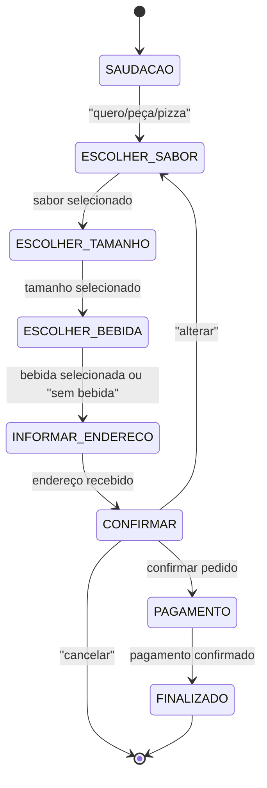

# 🍕 Chatbot de Pedidos de Pizza com Autômato Finito Determinístico (DFA)

## 1) Resumo do Tema
**Título:** Chatbot de Pedidos de Pizza com Autômato Finito Determinístico (DFA)  
**Objetivo:** Demonstrar estados, transições e ações usando um DFA que guia o usuário da saudação até a confirmação do pedido (sabor, tamanho, bebida, endereço) e finalização.

---

## 2) Diagrama de Estados (Mermaid)

---

## 3) Tabela de Estados e Transições

| Estado | Ação do Usuário | Próximo Estado |
|--------|-----------------|----------------|
| SAUDACAO | Dizer "quero pedir pizza" | ESCOLHER_SABOR |
| ESCOLHER_SABOR | Escolher sabor | ESCOLHER_TAMANHO |
| ESCOLHER_TAMANHO | Escolher tamanho | ESCOLHER_BEBIDA |
| ESCOLHER_BEBIDA | Escolher bebida | INFORMAR_ENDERECO |
| INFORMAR_ENDERECO | Informar endereço e telefone | CONFIRMAR |
| CONFIRMAR | Confirmar pedido | PAGAMENTO |
| CONFIRMAR | Alterar pedido | ESCOLHER_SABOR |
| CONFIRMAR | Cancelar pedido | Fim |
| PAGAMENTO | Escolher forma de pagamento | FINALIZADO |
| FINALIZADO | - | Fim |

---

## 4) Exemplo de Diálogo

**Usuário:** “Olá, quero pedir uma pizza.”  
**Bot:** “Qual tamanho? pequena/média/grande/familia”  
**Usuário:** “média.”  
**Bot:** “Ótimo! Qual sabor você quer? calabresa/portuguesa/frango/mussarela/quatro qeuijos”  
**Usuário:** “calabresa” 
**bot:** "Escolha a borda da pizza: sem borda/catupiry/cheddar
**usuario** "sem borda"
**Bot:** “Deseja bebida? nenhuma/coca-cola/suco/guaraná/água”  
**Usuário:** “Coca-Cola.”  
**Bot:** “Qual o endereço para entrega?”  
**Usuário:** “Rua rc, 358 ”   
**Bot:** “Como deseja pagar? dinheiro/cartão de credito/ cartao de debito/ pix”  
**Usuário:** “Cartão de credito” 
**Bot:** “Confirma: Pizza Calabresa (média) + Coca-Cola  — Entrega em Rua rc, 358 — Confirmar/Alterar/Cancelar”  
**Usuário:** “Confirmar” 
**Bot:** “Pedido confirmado! Chegará em ~45 minutos. Obrigado!”  

---

